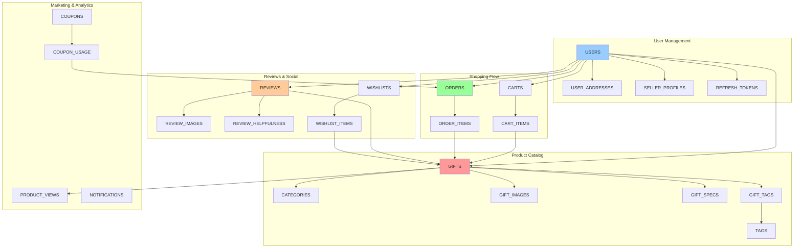
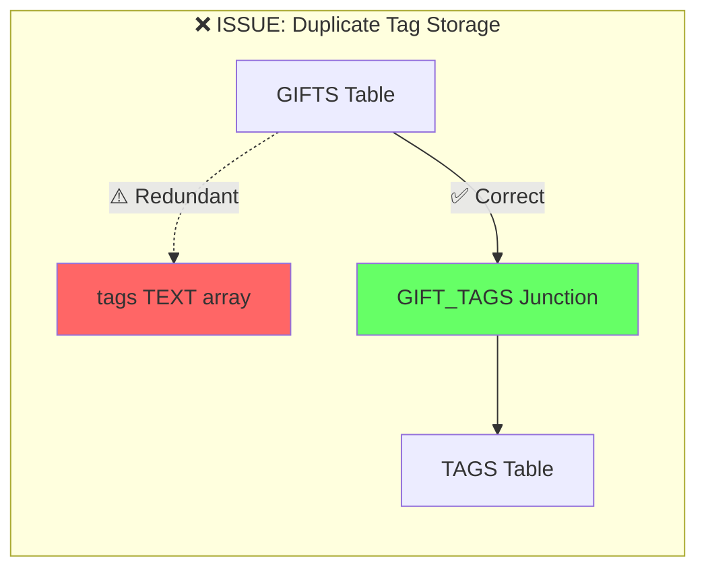
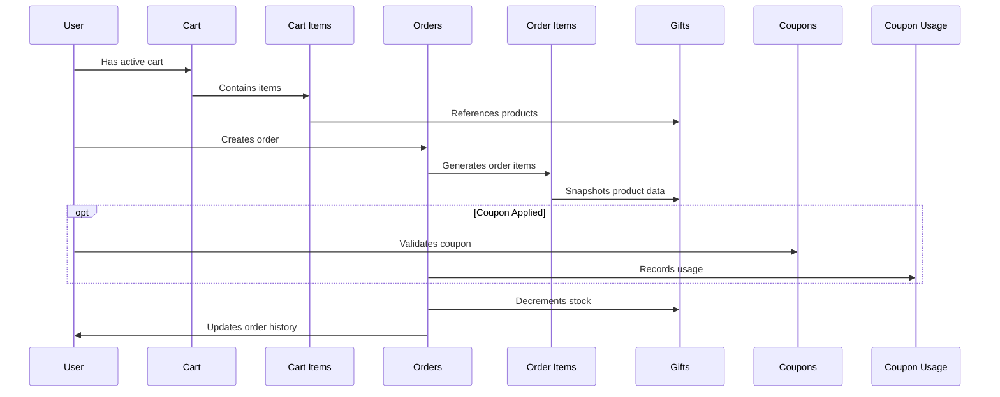
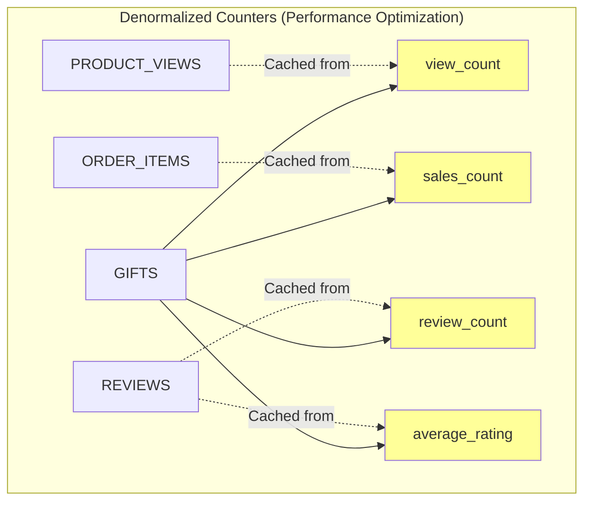

# Database Entity Relationship Diagram

This document contains the visual ER diagram for the GiftBox database schema.

## Full ER Diagram (Mermaid)

```mermaid
erDiagram
    %% Core User Entity
    USERS ||--o{ USER_ADDRESSES : "has"
    USERS ||--|| CARTS : "has one"
    USERS ||--o{ ORDERS : "places"
    USERS ||--o{ REVIEWS : "writes"
    USERS ||--o{ WISHLISTS : "creates"
    USERS ||--o| SELLER_PROFILES : "has profile"
    USERS ||--o{ GIFTS : "sells"
    USERS ||--o{ NOTIFICATIONS : "receives"
    USERS ||--o{ REFRESH_TOKENS : "has sessions"
    USERS ||--o{ PRODUCT_VIEWS : "views"
    USERS ||--o{ AUDIT_LOGS : "generates"
    USERS ||--o{ REVIEW_HELPFULNESS : "votes"
    USERS ||--o{ COUPON_USAGE : "redeems"
    
    %% Product/Gift Relationships
    GIFTS }o--|| CATEGORIES : "belongs to"
    GIFTS }o--|| USERS : "sold by"
    GIFTS ||--o{ GIFT_IMAGES : "has"
    GIFTS ||--o{ GIFT_SPECIFICATIONS : "has"
    GIFTS ||--o{ GIFT_TAGS : "tagged with"
    GIFTS ||--o{ CART_ITEMS : "in cart"
    GIFTS ||--o{ ORDER_ITEMS : "in order"
    GIFTS ||--o{ REVIEWS : "reviewed"
    GIFTS ||--o{ WISHLIST_ITEMS : "saved in"
    GIFTS ||--o{ PRODUCT_VIEWS : "tracked"
    
    %% Tags (Many-to-Many)
    TAGS ||--o{ GIFT_TAGS : "applied to"
    
    %% Category Hierarchy
    CATEGORIES ||--o{ CATEGORIES : "parent of"
    
    %% Cart Flow
    CARTS ||--o{ CART_ITEMS : "contains"
    
    %% Order Flow
    ORDERS ||--o{ ORDER_ITEMS : "contains"
    ORDERS }o--o| USER_ADDRESSES : "ships to"
    ORDERS ||--o{ COUPON_USAGE : "uses coupon"
    ORDER_ITEMS }o--|| GIFTS : "references"
    ORDER_ITEMS }o--|| USERS : "sold by"
    
    %% Review System
    REVIEWS }o--|| GIFTS : "for product"
    REVIEWS }o--|| USERS : "by user"
    REVIEWS }o--o| ORDER_ITEMS : "verified purchase"
    REVIEWS ||--o{ REVIEW_IMAGES : "has photos"
    REVIEWS ||--o{ REVIEW_HELPFULNESS : "voted on"
    
    %% Wishlist
    WISHLISTS ||--o{ WISHLIST_ITEMS : "contains"
    WISHLIST_ITEMS }o--|| GIFTS : "references"
    
    %% Coupons
    COUPONS ||--o{ COUPON_USAGE : "tracked"
    COUPON_USAGE }o--|| ORDERS : "applied to"
    
    %% Table Definitions
    USERS {
        uuid id PK
        string email UK
        string password_hash
        string full_name
        enum role
        string phone
        string profile_image_url
        enum account_status
        boolean email_verified
        timestamp created_at
        timestamp deleted_at
    }
    
    USER_ADDRESSES {
        uuid id PK
        uuid user_id FK
        enum address_type
        string full_name
        string phone
        string street_address_1
        string city
        string state
        string zip_code
        boolean is_default
    }
    
    CATEGORIES {
        uuid id PK
        string name UK
        string slug UK
        uuid parent_category_id FK
        integer depth
        boolean is_active
        integer sort_order
        timestamp deleted_at
    }
    
    GIFTS {
        uuid id PK
        uuid seller_id FK
        uuid category_id FK
        string title
        string slug UK
        text description
        decimal price
        integer stock_quantity
        string sku UK
        enum status
        boolean is_featured
        integer view_count
        integer sales_count
        decimal average_rating
        integer review_count
        text[] tags "⚠️ DUPLICATE"
        timestamp created_at
        timestamp deleted_at
    }
    
    GIFT_IMAGES {
        uuid id PK
        uuid gift_id FK
        string image_url
        boolean is_primary
        integer sort_order
    }
    
    GIFT_SPECIFICATIONS {
        uuid id PK
        uuid gift_id FK
        string spec_key
        text spec_value
        integer sort_order
    }
    
    TAGS {
        uuid id PK
        string name UK
        string slug UK
    }
    
    GIFT_TAGS {
        uuid gift_id FK
        uuid tag_id FK
        timestamp created_at
    }
    
    CARTS {
        uuid id PK
        uuid user_id FK "UK"
        string session_id
        timestamp created_at
    }
    
    CART_ITEMS {
        uuid id PK
        uuid cart_id FK
        uuid gift_id FK
        integer quantity
        decimal price_at_addition
    }
    
    ORDERS {
        uuid id PK
        string order_number UK
        uuid customer_id FK
        decimal subtotal
        decimal tax_amount
        decimal shipping_fee
        decimal discount_amount
        decimal total_amount
        enum order_status
        enum payment_status
        enum payment_method
        uuid shipping_address_id FK
        string shipping_full_name "snapshot"
        string tracking_number
        timestamp created_at
    }
    
    ORDER_ITEMS {
        uuid id PK
        uuid order_id FK
        uuid gift_id FK
        uuid seller_id FK
        string gift_title "snapshot"
        decimal unit_price
        integer quantity
        decimal total_amount
        enum status
        decimal commission_amount
    }
    
    REVIEWS {
        uuid id PK
        uuid gift_id FK
        uuid user_id FK
        uuid order_item_id FK
        integer rating
        string title
        text comment
        enum status
        integer helpful_count
        integer unhelpful_count
        boolean is_verified_purchase
        timestamp created_at
    }
    
    REVIEW_IMAGES {
        uuid id PK
        uuid review_id FK
        string image_url
        integer sort_order
    }
    
    REVIEW_HELPFULNESS {
        uuid id PK
        uuid review_id FK
        uuid user_id FK
        enum helpfulness_type
    }
    
    WISHLISTS {
        uuid id PK
        uuid user_id FK
        string name
        boolean is_public
        timestamp created_at
    }
    
    WISHLIST_ITEMS {
        uuid id PK
        uuid wishlist_id FK
        uuid gift_id FK
        text notes
    }
    
    NOTIFICATIONS {
        uuid id PK
        uuid user_id FK
        enum type
        string title
        text message
        boolean is_read
        jsonb metadata
        timestamp created_at
    }
    
    COUPONS {
        uuid id PK
        string code UK
        enum type
        decimal discount_value
        integer usage_limit
        integer used_count
        enum status
        timestamp valid_from
        timestamp valid_until
        uuid[] applicable_category_ids "⚠️ No FK"
        uuid[] applicable_gift_ids "⚠️ No FK"
    }
    
    COUPON_USAGE {
        uuid id PK
        uuid coupon_id FK
        uuid user_id FK
        uuid order_id FK
        decimal discount_amount
        timestamp created_at
    }
    
    SELLER_PROFILES {
        uuid id PK
        uuid user_id FK "UK"
        string business_name
        text business_description
        integer total_sales
        decimal total_revenue
        decimal average_rating
        boolean is_verified
        timestamp created_at
    }
    
    AUDIT_LOGS {
        uuid id PK
        uuid user_id FK
        enum action
        string entity_type
        uuid entity_id
        jsonb old_values
        jsonb new_values
        inet ip_address
        timestamp created_at
    }
    
    REFRESH_TOKENS {
        uuid id PK
        uuid user_id FK
        string token UK
        timestamp expires_at
        boolean is_revoked
        timestamp created_at
    }
    
    PRODUCT_VIEWS {
        uuid id PK
        uuid gift_id FK
        uuid user_id FK
        string session_id
        inet ip_address
        timestamp viewed_at
    }
```



## Simplified Core Relationships



## Critical Issues Highlighted



## Data Flow: Order Creation



## Normalization Issues



---

## How to View These Diagrams

### Option 1: GitHub/GitLab

These Mermaid diagrams will render automatically when viewing this file on GitHub or GitLab.

### Option 2: VS Code

Install the "Markdown Preview Mermaid Support" extension.

### Option 3: Online Viewer

Copy the Mermaid code and paste it into: <https://mermaid.live/>

### Option 4: Generate PNG

Use the Mermaid CLI:

```bash
npm install -g @mermaid-js/mermaid-cli
mmdc -i DATABASE_ER_DIAGRAM.md -o database-diagram.png
```

---

## Legend

- **PK**: Primary Key
- **FK**: Foreign Key  
- **UK**: Unique Key
- **||--o{**: One-to-Many relationship
- **}o--||**: Many-to-One relationship
- **||--||**: One-to-One relationship
- **||--o{**: Many-to-Many (via junction table)
- **⚠️**: Issue or warning
- **❌**: Critical problem
- **✅**: Correct implementation
